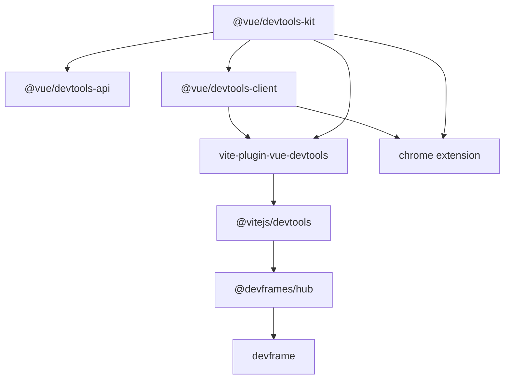

# AGENTS GUIDE

## Positioning

Vue DevTools v9 ships two hosts over one kit and one client. The Vite plugin is a dock inside Vite DevTools. The Chromium extension is its own DevTools panel and does not go through Vite.

- **`@vue/devtools-kit` + `@vue/devtools-client`** — shared runtime and UI: component tree, state, timeline, Pinia, pages, reactivity graph, and the v6 plugin setup API (`setupDevToolsPlugin`, alias `setupDevtoolsPlugin`).
- **`vite-plugin-vue-devtools`** — Vite host. Requires Vite 8.3.0+ and a project-level `@vitejs/devtools` (`devtools: { apply: 'serve' }` is recommended) next to `plugins: [vueDevTools()]`. This package does not register `DevTools()` and does not brand the shared Vite shell. Sibling repo: `../vite-devtools`. Read its [AGENTS.md](../vite-devtools/AGENTS.md) before changing dock, command, or open-in-editor behavior.
- **`@vue/devtools-chrome`** — Chromium MV3 host. Content backend calls `createDevtoolsKit({ clientName: 'chrome-extension' })` on the page and bridges the panel on channel `vue-devtools:chrome-extension`. It works on any page that runs Vue, including apps that never load Vite DevTools.

`devframe` / `@devframes/hub` (docs: [devfra.me](https://devfra.me)) matter on the Vite path: docks, commands, terminals, messages. The extension does not use that hub. Features that only exist when several Vite tools share a UI (custom tabs, commands, split screen, the floating inspector button) belong in Vite DevTools. Vue-level `addCustomTab` / `addCustomCommand` stay removed on both hosts. Custom inspectors, component hooks, timeline layers, and plugin settings stay on the Vue plugin API.

## Stack & Structure

Monorepo (`pnpm` workspaces). ESM TypeScript. Library packages bundle with Vite Plus (`vp pack`). Node **22.12+**, pnpm **12.5.1** (`packageManager`). Versions live in `pnpm-workspace.yaml` `catalog:` (and matching `overrides`); package entries use `"catalog:"`.

### Packages

| Package                 | npm                        | Description                                                                                                                                                  |
| ----------------------- | -------------------------- | ------------------------------------------------------------------------------------------------------------------------------------------------------------ |
| `packages/kit`          | `@vue/devtools-kit`        | Runtime, codec, RPC, plugin registry. Exports only `dist`.                                                                                                   |
| `packages/devtools-api` | `@vue/devtools-api`        | Public plugin API surface over the kit.                                                                                                                      |
| `packages/client`       | `@vue/devtools-client`     | Vue 3 + UnoCSS UI shared by both hosts. Private. Vite plugin copies the build into `packages/vite/client`; the extension loads the same client in its panel. |
| `packages/vite`         | `vite-plugin-vue-devtools` | Vite host. Serves the static client and registers an iframe dock with `@vitejs/devtools`.                                                                    |
| `packages/chrome`       | `@vue/devtools-chrome`     | Chromium MV3 host (background, content backend, DevTools panel). Private. Zip via `pnpm zip:chrome`.                                                         |

Other top-level directories:

- `docs/` — VitePress. Migration guide is `docs/guide/migration.md`.
- `playground/basic` — `@vue/devtools-playground-basic`.
- `playground/reactivity-graph` — graph tracer playground.
- `tests/` — unit, integration, performance, and smoke (Vite + Chrome).



## Dep Boundary

On the Vite host, docks, commands, terminals, and open-in-editor stay in `@vitejs/devtools`. Open-in-editor is forwarded as `vite:core:open-in-editor`, gated by `capabilities.openInEditor`. The extension panel does not offer open-in-editor; that action exists only in the Vite dock.

`vueDevTools()` options are `enabled` and `appendTo`. Dock layout, built-in integrations, and open-in-editor stay on Vite's `devtools` config. Runtime `budget` is a kit option.

Keep `vite-plus` pinned to exact `0.3.0` in the catalog. `0.3.3` breaks `vp pack` against Vite 8.3, and a caret range still resolves `0.3.3`.

## Architecture

- **Mount paths.** The Vue client is `{base}__devtools__/`. The Vite DevTools hub is `/__devtools/`. Those are different endpoints.
- **RPC.** The extension uses `vue-devtools:chrome-extension`. The Vite dock keeps the default `vue-devtools` channel so both can be installed together.
- **State.** Component state lives in `@vue/devtools-kit`. The client only renders it. `isComputedRef` has one implementation, in `packages/kit/src/codec`. A second copy in `state.ts` breaks the client build.

## Usage

### Vite plugin

Dev dependency: `vite-plugin-vue-devtools`, plus `vite@^8.3.0` and `@vitejs/devtools`.

```ts
import { defineConfig } from 'vite'
import vueDevTools from 'vite-plugin-vue-devtools'

export default defineConfig({
  devtools: {
    apply: 'serve',
  },
  plugins: [vueDevTools()],
})
```

`devtools: { apply: 'serve' }` turns on the Vite DevTools host during development, matching Vue's development-only integration. Use `devtools: true` only when the host should also run during builds. Dock layout and built-ins stay on the host object, not on `vueDevTools()`:

```ts
export default defineConfig({
  devtools: {
    apply: 'serve',
    builtinDevTools: false,
    embeddedVisibility: 'passive',
    dockPreferences: {
      defaultMode: 'edge',
      defaultPosition: 'bottom',
    },
  },
  plugins: [
    vueDevTools({
      enabled: true,
      // Apps without a Vite HTML entry. String matches the end of the resolved path.
      appendTo: ['resources/js/app.ts', /\/entry\.client\.m?js$/],
    }),
  ],
})
```

Open the running app, then Vite DevTools → Vue. The Vue client is at `{base}__devtools__/`. Host options: [devtools.vite.dev/guide](https://devtools.vite.dev/guide/).

### Chrome extension

Published build (Chrome, and other Chromium browsers via the same listing):

https://chromewebstore.google.com/detail/vuejs-devtools/nhdogjmejiglipccpnnnanhbledajbpd

Load this repo's build unpacked from `packages/chrome` after `pnpm --filter @vue/devtools-chrome build`. `pnpm zip:chrome` writes `dist/devtools-chrome.zip`. Open the page, then Chrome DevTools → Vue. The panel does not require `devtools: true` or the Vite plugin.

## Development

```sh
pnpm i
pnpm build          # client before vite-plugin-vue-devtools, which copies client/dist
pnpm play           # playground/basic — requires a prior build of kit, client, and the Vite plugin
pnpm play:reactivity-graph
pnpm test           # vitest run
pnpm test:unit
pnpm test:integration
pnpm lint           # vp lint
pnpm format         # vp fmt
pnpm typecheck      # vue-tsc, client project
pnpm docs           # VitePress
```

After kit, client, or plugin changes that the playground must see:

```sh
pnpm --filter @vue/devtools-kit --filter @vue/devtools-client --filter vite-plugin-vue-devtools build
```

`pnpm test:smoke:vite` and `pnpm test:smoke:chrome` build the packages they need. `pnpm dep:up` bumps the catalog.

## Before PRs

```sh
pnpm lint && pnpm test && pnpm typecheck && pnpm build
```

## Documentation style

Applies to Markdown under `docs/`.

- Describe what the product does today. Release notes carry “now supported”.
- Default to prose. Reserve `> [!WARNING]` for security hazards, footguns, and breaking-change pitfalls.
- Document both hosts when a page describes how to open Vue DevTools: the Vite plugin (`vueDevTools()` with `@vitejs/devtools`) and the Chromium extension. Link Vite-only host APIs to [devtools.vite.dev](https://devtools.vite.dev) and [devfra.me](https://devfra.me) instead of restating them.
- One sentence up front that says what the page is for. One cross-link per destination is enough.
